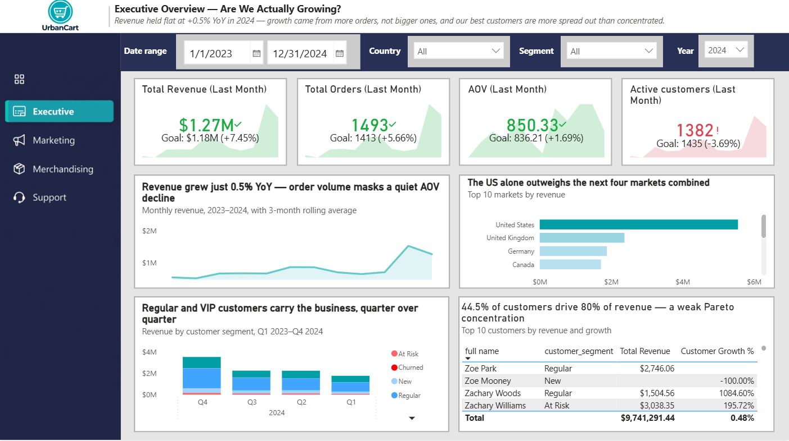
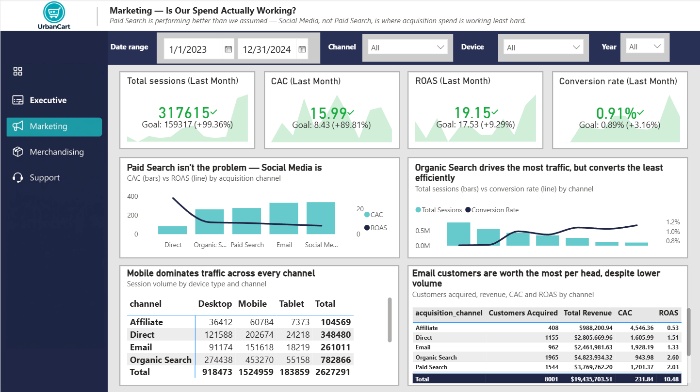
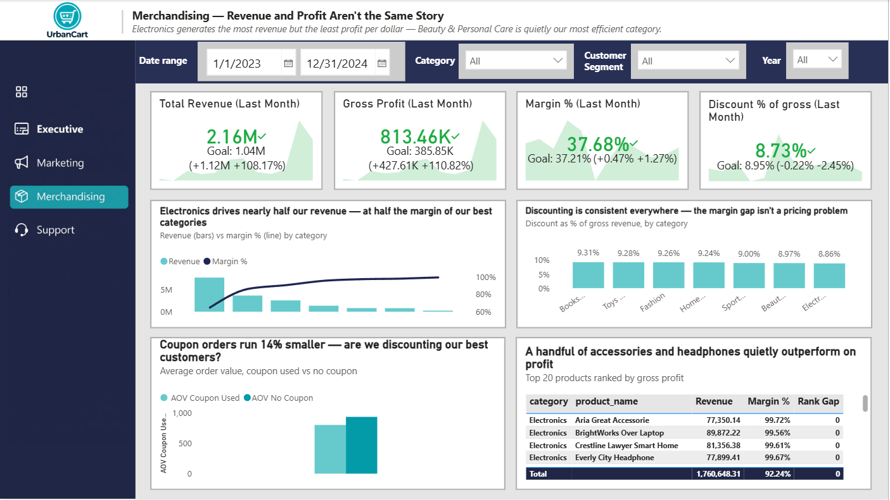
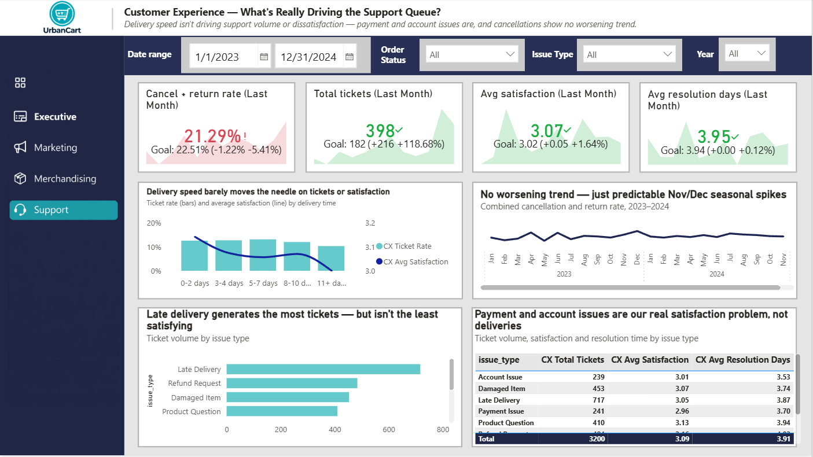

  

# Project Background

UrbanCart is a mid-sized global online marketplace selling across seven categories, shipping to 10 countries and serving roughly 8,000 active customer accounts. After two years of rapid growth — new categories, new markets, a growing marketing budget — leadership lost a single trusted source of truth: teams were making decisions off gut feel and conflicting spreadsheets, and no one had connected the dots between marketing spend, product performance, delivery experience, and profit.

As the incoming Data Analyst, four functional leaders each brought one open question. The engagement scope was intentionally limited to these four questions — clean the underlying data, answer each with SQL, build a self-serve Power BI reporting layer, and summarize findings with prioritized, evidence-backed recommendations.

The full business brief and stakeholder quotes are available [here](report/UrbanCart_Business_Story_and_Questions.docx).

The SQL used to clean, dedupe, and model the seven raw exports into a star schema can be found [here](sql/01_cleaning_and_modeling.sql).

The business-question SQL, organized by stakeholder, can be found [here](sql/02_business_questions.sql).

The full set of Power BI DAX measures, organized by dashboard page, can be found [here](dax/measures.dax).

The full written report — executive summary, per-stakeholder findings, data quality disclosures, and prioritized recommendations — is available [here](report/UrbanCart_Final_Report.docx).

The interactive Power BI dashboard, including all visualizations, KPIs, filters, and stakeholder-focused analysis, is available  [here](https://app.powerbi.com/view?r=eyJrIjoiZDk4MTZkMDMtZGY2MC00NTI2LWJhNWUtNGRjMjhmNzA3ZmJjIiwidCI6IjJiYjZlNWJjLWMxMDktNDdmYi05NDMzLWMxYzZmNGZhMzNmZiIsImMiOjl9&pageName=87da563cc714ee38dad6).

 

# Data Structure & Model

The cleaned data is modeled as a star schema with five fact tables (one per business process) and four conformed dimensions, connecting seven raw CSV exports:

- **vw_fact_orders** — grain: one row per order. `order_id`, `customer_id`, `order_date`, `order_status`, `order_total`, `delivery_days`, `coupon_code`, `payment_method`.
- **vw_fact_order_items** — grain: one row per order line item. `order_id`, `product_id`, `quantity`, `unit_price`, `line_discount_pct`, `line_total`.
- **vw_fact_marketing_campaigns** — grain: one row per campaign. `channel_key`, `budget_usd`, `clicks`, `impressions`, `start_date`, `end_date`.
- **vw_fact_website_traffic** — grain: one row per channel/device/day. `channel_key`, `device`, `sessions`, `bounce_rate`, `avg_session_duration_sec`.
- **vw_fact_support_tickets** — grain: one row per ticket. `order_id`, `customer_id`, `channel_key`, `issue_type`, `opened_date`, `resolved_date`, `satisfaction_score`.
- **vw_dim_customers** — one row per customer (~8,000 rows) — `country`, `customer_segment` (VIP / Regular / New / At Risk / Churned / Unknown), `acquisition_channel_key`.
- **vw_dim_products** — one row per SKU — `category`, `sub_category`, `cost_price`, `list_price`, `brand`.
- **vw_dim_channel** — one row per acquisition/marketing channel (7 channels: Organic Search, Paid Search, Social Media, Email, Direct, Referral, Affiliate).
- **vw_dim_date** — standard date dimension, marked as the model's official Date Table.

Two relationships are intentionally set **inactive** to avoid ambiguous filter paths through the date dimension, and activated on demand with `USERELATIONSHIP()`:
`vw_fact_orders[order_id] → vw_fact_support_tickets[order_id]`, and `vw_dim_date[Date] → vw_fact_support_tickets[resolved_date]`.

 

# Executive Summary

UrbanCart did not grow meaningfully in 2024 — revenue rose just **+0.5% year-over-year** ($9.69M → $9.74M), with order count outpacing revenue growth, meaning average order value quietly declined. The business is not in crisis, but it is not on a growth trajectory either.

Two of the four stakeholders' working assumptions were directly contradicted by the data: **Paid Search — not Social Media — is the stronger-performing acquisition channel**, and **delivery speed has almost no measurable effect on support ticket volume or customer satisfaction**, despite both being the leading internal hypotheses going into this analysis. The strongest, most actionable finding is on the profit side: **Electronics drives 45% of revenue at less than half the margin of UrbanCart's most efficient category (Beauty & Personal Care)** — a structural cost issue, not a discounting problem, since discount rates are flat (~9%) across every category.

 

# Insights Deep Dive

### Category 1: Revenue Growth & Customer Concentration (CEO)

* **Revenue grew just 0.48% YoY** ($9,694,412 in 2023 → $9,741,291 in 2024), while order count grew 1.1% — meaning the business processed more orders without growing revenue proportionally, a quiet AOV decline.
* **Customer concentration is weaker than a healthy benchmark**: 44.5% of customers drive 80% of revenue, versus the ~20% Pareto benchmark, meaning UrbanCart lacks a small, defensible core of high-value loyal customers to anchor retention strategy around.
* **The USA is the dominant market**, outweighing the next four countries (UK, Germany, Canada, and the next-largest market) combined — geographic concentration risk worth board-level awareness.
* A small, disclosed data quality gap (~$75K in revenue tied to an unresolved `customer_id = "UNKNOWN"`) is documented rather than silently hidden — see Data Quality section below.

### Category 2: Marketing Channel Efficiency (VP Marketing)

* **Paid Search (8.82x ROAS, $276.88 CAC) outperforms Social Media (6.69x ROAS, $338.19 CAC)** — directly contradicting the stakeholder's stated assumption that "Paid Search feels expensive." Social Media is both the second-largest spend line and the weakest performer among tracked channels.
* **Email has the highest revenue-per-customer** despite modest acquisition volume — a smaller, more valuable channel that's easy to overlook when ranking purely by customer count.
* **Direct channel shows a 28.6x ROAS on $98K of spend** — flagged as a likely misattribution (brand/awareness spend bleeding into "Direct" traffic) rather than a genuine acquisition bargain, and explicitly excluded from budget-reallocation recommendations until proper multi-touch attribution is in place.
* **Referral and Affiliate channels have no tracked campaign spend** in the source data — a completeness gap, not evidence these channels are genuinely free.

### Category 3: Category Profitability (Merchandising)

* **Electronics generates $7.82M in revenue (the largest of any category) but converts it to profit at only 28.7% margin** — the weakest in the portfolio.
* **Beauty & Personal Care converts revenue to profit more than twice as efficiently (58.4% margin)** despite being one of UrbanCart's smallest categories by volume — an under-invested, high-efficiency segment.
* **Discount rates are consistent across every category (~8.7%–9.3%)**, ruling out over-discounting as the explanation for Electronics' weak margin — this is a cost-structure problem, not a promotional one.
* **Coupon-used orders run 14% smaller on average** ($803 vs. $937 AOV) — raising the question of whether coupons are attracting price-sensitive customers or training otherwise high-value customers to wait for a discount.
* A handful of high-margin accessories (headphones, laptop accessories) rank far higher on profit than on revenue — small-volume, high-efficiency "hidden gem" SKUs worth promotional prioritization.

### Category 4: Delivery, Support & Cancellations (Customer Experience)

* **Delivery speed shows minimal correlation with support ticket volume or satisfaction** — ticket rate stays in a flat 8%–13% band regardless of whether delivery took 2 days or 10, directly contradicting the stakeholder's working hypothesis that delivery delays were driving the growing support queue.
* **Payment Issues (2.96 satisfaction) and Account Issues (3.01) are the true lowest-satisfaction categories** — both scoring worse than Late Delivery (3.05), the ticket type with the highest volume (717 tickets) but not the lowest satisfaction.
* **The combined cancellation + return rate is 19.3%**, with no worsening secular trend — monthly fluctuation tracks seasonal order-volume spikes (November/December in both years), not a degrading operation.

 

# Recommendations

Ranked by expected impact on profit and defensibility of the underlying evidence:

1. **Shift merchandising strategy from revenue growth to margin growth.** De-prioritize further Electronics volume push; actively grow Beauty & Personal Care and Books & Stationery through bundling and cross-sell placement. Audit Electronics' supplier cost structure directly rather than relying on discounting, since discounting is already flat and healthy.

2. **Reallocate 15–20% of Social Media budget toward Paid Search and Email**, based on measured ROAS rather than channel popularity or internal assumption. Treat Direct channel's reported ROAS with caution until proper attribution modeling is in place.

3. **Redirect CX investigation and improvement budget from delivery-speed initiatives toward payment flow and account management UX** — the data does not support delivery as the primary driver of dissatisfaction, but payment/account issues clearly are.

4. **Build a targeted retention program for the "At Risk" customer segment** before churn compounds further — the customer base is broad but shallow, lacking a concentrated VIP core to fall back on.

5. **Resolve the data quality issues below** before undertaking any customer lifetime value, attribution, or segmentation-dependent analysis in Phase 2.

 

# Data Quality & Limitations

The following issues were identified during this engagement and are disclosed here for transparency. None materially change the conclusions above, but each should be resolved before deeper analysis (e.g., customer lifetime value modeling) is attempted.

* **Unattributed marketing channel:** 96 customers have a NULL `acquisition_channel_key`, representing **$79,691.08** in revenue currently invisible in all channel-based reporting — these customers do not appear as a row on the Marketing page, they are silently excluded from the relationship rather than shown as an honest "Unknown" bucket.

* **Shared placeholder customer ID:** a separate set of 96 orders share a single placeholder `customer_id` under the "Unknown" channel. Power BI currently reports this as **1 customer** rather than up to 96 distinct individuals, understating true customer counts and distorting any per-customer metric (e.g., CAC) calculated for that segment.

* **Unresolved customer reference:** **$75,233.37** in revenue across 84 orders is attributed to a `customer_id` value of `"UNKNOWN"` in the source data — a broken customer reference that could not be resolved during cleaning, disclosed via a subtitle note on the Executive dashboard rather than hidden.

**Recommendation:** route all three issues to data engineering as a prioritized backlog item — assign proper unique customer IDs at the source system level, and investigate why channel attribution fails to populate for this subset of records.

 

# Phase 2 Roadmap

Phase 1 told UrbanCart what happened and why. The proposed Phase 2 tells them what's about to happen — and what to do before it does:

| Initiative | What it does | Owner | Why now |
|---|---|---|---|
| **Customer Churn Prediction** | Monthly churn-risk scoring per customer using RFM + support/satisfaction signals already in the model | CEO, CX | 44.5% of customers drive 80% of revenue with no strong VIP core — this lets UrbanCart intervene before "Regular" becomes "At Risk" |
| **Marketing Mix Modeling** | Statistical model isolating true incremental channel impact, beyond last-click ROAS | Marketing | Resolves the Direct-channel attribution ambiguity flagged in this report |
| **Demand Forecasting & Inventory Optimization** | Category/SKU-level forecasting tied to the margin data built in Phase 1 | Merchandising | Now that Beauty & Personal Care is confirmed under-invested relative to its margin, forecasting tells the team exactly how much to stock |
| **Automated Anomaly Alerts** | Push notifications when a KPI moves outside its normal range | All stakeholders | Turns the dashboard from "pull" (someone checks it) to "push" (it flags problems) |
| **Data Quality Remediation Sprint** | Fixes the 3 issues flagged above at the source system level | Data/IT | Fast, low-risk, builds trust ahead of larger Phase 2 investment |

 

# Assumptions and Caveats

* All revenue, profit, and rate figures exclude **Cancelled** orders; profit and discount figures additionally exclude **Returned** orders, applied consistently across both the SQL validation queries and the corresponding DAX measures.
* `Merch Gross Revenue Before Discount` and `Merch Cost` must carry the same order-status filter as `Merch Revenue` — an early build iteration had this mismatched, inflating the reported discount rate roughly 3x versus the SQL-validated ~9% baseline. This is corrected in the current model and documented in `dax/measures.dax`.
* `SAMEPERIODLASTYEAR()`-based prior-year comparisons require `vw_dim_date` to be marked as the model's official Date Table; once marked, the automatic Year/Quarter/Month drill hierarchy is disabled by design, and explicit `Year` / `Month_Name` columns (sorted by a numeric helper column) are used on visual axes instead.
* KPI cards across all four pages use a **native Power BI KPI visual bound to a monthly trend axis**, which — by the visual's own design — displays only the most recent period in the selected range, not a running total for the full filtered period. This is intentional (titled "(Last Month)" on every card) and is a deliberate design choice made with the client, not a data error; full-period totals are always available in the charts and tables beneath each KPI row.
* This project uses fictional business data (UrbanCart) prepared as a realistic, intentionally "messy" case-study export — duplicates, nulls, inconsistent casing, and a few broken references were present by design and handled per the documented cleaning rules in `sql/01_cleaning_and_modeling.sql`.
